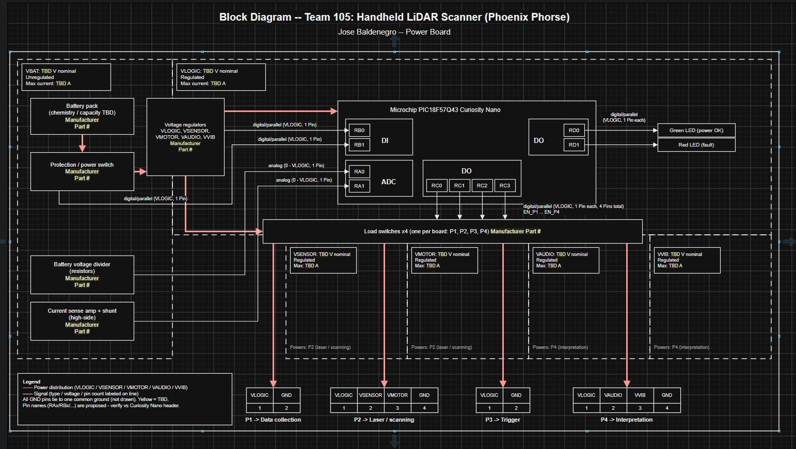

## Overvie
* Power source: A battery pack feeding protection and a power switch, then the voltage regulators. The battery chemistry and capacity are still TBD.
* Power levels: VBAT (unregulated), plus the regulated rails VLOGIC, VSENSOR, VMOTOR, VAUDIO and VVIB, all with common ground. The voltages and currents are TBD.
* Sensors: Only monitoring ones. A battery voltage divider and a current-sense amp feed the microcontroller's ADC pins, and it also reads a power-good signal and the power switch state. The LiDAR and other sensors belong to your teammates' boards.
* Actuators: None driven directly except the two status LEDs and the per-board load switches. Indirectly, you power the other boards' actuators: the motor (VMOTOR), speaker (VAUDIO), vibration motor (VVIB) and laser/scanning (VSENSOR).
* Team connections: Four separate power connectors: P1 to Data Collection, P2 to Laser/Scanning, P3 to Trigger, P4 to Interpretation. These are power only, not the J1–J3 data ribbons.
* Control and safety: The PIC18F57Q43 Curiosity Nano turns each board's power on and off separately and reports faults on the LEDs. The protection stage guards the battery and the boards

## Jose Baldsenegro Block Diagram 
Showing an example of how to import a screenshot of the block diagram created outside of git and brought into a page.

